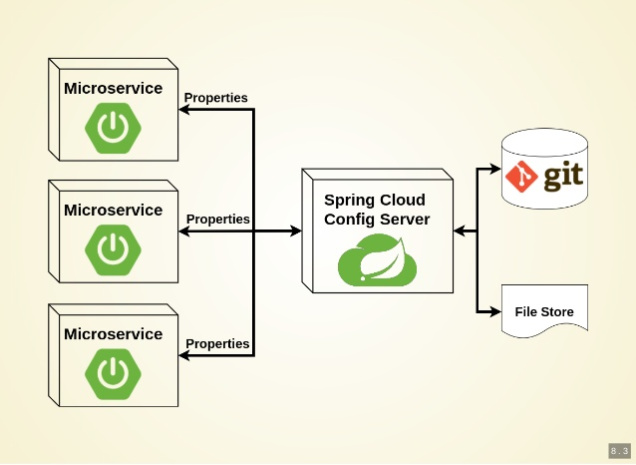
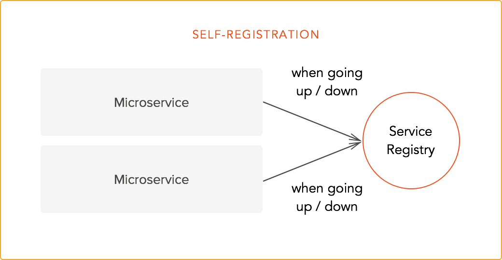
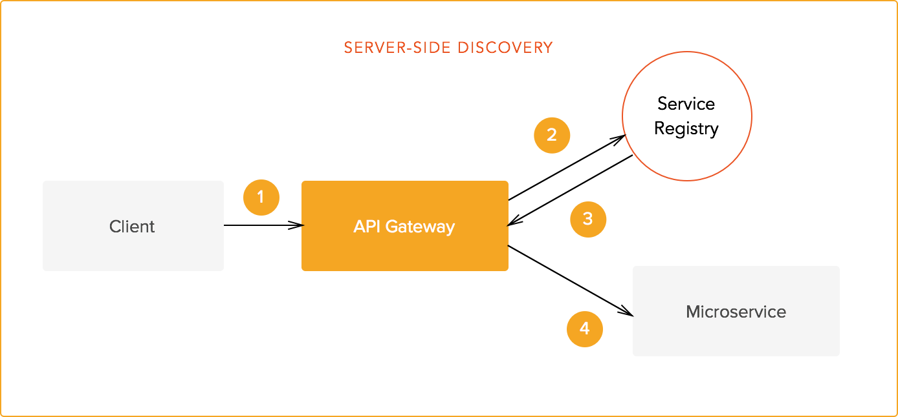

# 12 Factor App Development
Folks from Heroku wrote this. (Now owned by Salesforce)
## I. Codebase
One codebase tracked in revision control, many deploys
* Configuration-as-a-Service
## II. Dependencies
Explicitly declare and isolate dependencies
* VM, Docker, Ant, Gradle, Maven, Containerization...
## III. Config
Store config in the environment
* Configuration-as-a-Service
## IV. Backing services
Treat backing services as attached resources
* JDBC, JPA, AMQP, CMIS...
## V. Build, release, run
Strictly separate build and run stages
* Configuration-as-a-Service
## VI. Processes
Execute the app as one or more stateless processes
* Kubernetes, Service Registry, Service Gateway
## VII. Port binding
Export services via port binding
* Kubernetes, Service Discovery
* Avoid container determined port/micromanaging port
## VIII. Concurrency
Scale out via the process model
* Kubernetes, Service Discovery
## IX. Disposability
Maximize robustness with fast startup and graceful shutdown
* Faster Recovery from failure, Service Discovery
## X. Dev/prod parity
Keep development, staging, and production as similar as possible
* Configuration-as-a-Service
## XI. Logs
Treat logs as event streams
* Observability (OpenTracing/OpenCensus)
## XII. Admin processes *Not scope for this discussion*
Run admin/management tasks as one-off processes

# Moving to Cloud
## Lift and shift
* Complex (not Complicated) to operate
* Security (layers of security)
* Funny Money V. Actual Cost

# Design applications to be Cloud native (Demo)

## Configuration as a service

* Spring Config Server
* Manage configuration outside of the code
* backend can be file system, git, Vault
* Profile based configuration lookup
* Auto Refresh, if we want

## Service Discovery

* Eureka
* Consul

## Service Gateway

* routing, authentication, authorization, load balancing (client side)
* Spring Cloud Gateway (Reactive)
* Zuul
* Consul
* Ingress

## Observability (OpenTracing)

Let's talk a little bit about OpenTracing/OpenCensus concept.
* Trace
* Span

>––|–––––––|–––––––|–––––––|–––––––|–––––––|–––––––|–––––––|–––––––> time\
> [Trace 1......................................................]\
> [Span A···················································]\
>   [Span B··············································]\
>      [Span D··········································]\
>    [Span C········································]\
>         [Span E·······]        [Span F··] [Span G··] [Span H··]

## Let's review what demo application is doing.
* Basic rest application with Spring data JPA
* Demo the basic functionality. 

### Add Slueth (OpenTracing/OpenCensus library)
* Automatically instruments Rest Endpoint, AMQP.
* Add logging, and it will maintain Spans
* Programmatically add additional Spans (Or Traces)
* Can be used across threads (and even across services in different container, more about that later)

### Add Zipkin
* This is more about sending the data to visualization tool endpoint
* default is capture certain %, but we will override to capture everything.

## Visualization tools
I have used Zipkin & ES APM, but heard about Jaeger too. As per documentation, Splunk is also supported.

### Zipkin
* Zipkin install and start: To start a zipkin in docker
> docker run -d -p 9411:9411 openzipkin/zipkin
* Zipkin URL: http://localhost:9411

### Jaeger
* Jaeger install and : 
> docker run -d --name jaeger -e COLLECTOR_ZIPKIN_HTTP_PORT=9411 -p 5775:5775/udp -p 6831:6831/udp -p 6832:6832/udp -p 5778:5778 -p 16686:16686 -p 14268:14268 -p 9411:9411 jaegertracing/all-in-one:1.8
* Jaeger URL: http://localhost:16686 

**NOTE:** Run either Zipkin or Jaeger as i am configuring same port. It is not needed, just less config while doing the demo.

### Tracing across services and containers

## Closing topic
### ElasticSearch
#### Application Performance Monitoring
* Logstash/Fluentd
* APM (directly send information or send via Logstash/Fluentd)
* Logging to standard output! (controversial but thought provoking...)
